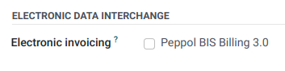

================================================================
Electronic invoicing (:abbr:`EDI (electronic data interchange)`)
================================================================

EDI, or electronic data interchange, is the inter-company communication of business documents, such
as purchase orders and invoices, in a standard format. Sending documents according to an EDI
standard ensures that the machine receiving the message can interpret the information correctly.
Various EDI file formats exist and are available depending on your company's country.

EDI feature enables automating the administration between companies and might also be required by
some governments for fiscal control or to facilitate the administration.

Electronic invoicing of your documents such as customer invoices, credit notes or vendor bills is
one of the application of EDI.

.. _e-invoicing/configuration:

Configuration
=============

Go to :menuselection:`Accounting --> Configuration --> Journals --> Customer Invoices --> Advanced
Settings --> Electronic Invoicing` and enable the formats you need for this journal.

Once an electronic invoicing format is enabled, XML documents are generated when clicking on
:guilabel:`Confirm` in documents such as invoices, credit notes, etc. These documents are either
visible in the attachment section, or embedded in the PDF.

.. note::
   - For E-FFF, the xml file only appears after having generated the PDF (:guilabel:`Print` or
     :guilabel:`Send & Print` button), since the PDF needs to be embedded inside the xml.
   - Every PDF generated from Leansoft contains a :guilabel:`Factur-X` XML file (for interoperability purpose).
     For German and French companies, the option :guilabel:`Factur-X (PDF/A-3)` in addition enables
     validation checks on the invoice and generates a PDF/A-3 compliant file, required by plaftorms like Chorus Pro.
   - The formats available depend on the country registered in your company's :guilabel:`General
     Information`.
   - Leansoft supports the **Peppol BIS Billing 3.0** format that can be used via existing access
     points.
