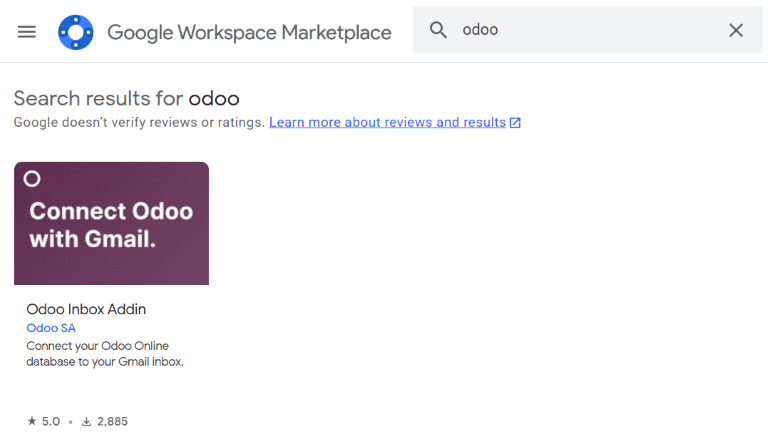
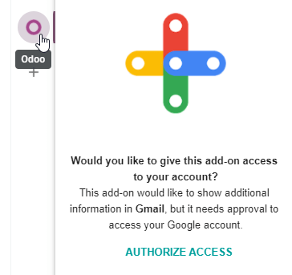

============
Gmail Plugin
============

The *Gmail Plugin* integrates an Leansoft database with a Gmail inbox, so users can keep track of all
their work between Gmail and Leansoft, without losing any information.

Leansoft Online users
=================

For databases hosted on Leansoft Online (or Leansoft.sh), follow the steps below to configure the Gmail
Plugin.

Install the Gmail Plugin
------------------------

First, log in to the Gmail account that the user wishes to connect to Leansoft.

From the Gmail inbox, click the plus sign icon on the right side panel to get add-ons. If the side
panel is not visible, click on the arrow icon at the bottom right corner of the inbox to reveal it.

.. image:: gmail/gmail-side-panel.png
   :align: center
   :alt: Plus sign icon on the Gmail inbox side panel.

Then, use the search bar to search for `Odoo` and locate the :guilabel:`Leansoft Inbox Addin`.

Or, go directly to the :guilabel:`Leansoft Inbox Addin` page on the `Google Workspace Marketplace
<https://workspace.google.com/marketplace/app/odoo_inbox_addin/873497133275>`_.

Once the plugin is located, click :guilabel:`Install`. Then, click :guilabel:`Continue` to start
the installation.

Next, select which Gmail account the user wishes to connect to Leansoft. Then click :guilabel:`Allow`
to let Leansoft access the Google account. Google will then show a pop-up window confirming that the
installation was successful.

Configure the Leansoft database
---------------------------

The :guilabel:`Mail Plugin` feature must be enabled in the Leansoft database in order to use the Gmail
Plugin. To enable the feature, go to :menuselection:`Settings --> General Settings`. Under the
:guilabel:`Integrations` section, activate :guilabel:`Mail Plugin`, and then click
:guilabel:`Save`.

.. image:: gmail/mail-plugin-setting.png
   :align: center
   :alt: The Mail Plugin feature in the Settings.

Configure the Gmail inbox
-------------------------

In the Gmail inbox, a purple Leansoft icon is now visible on the right side panel. Click on the Leansoft
icon to open up the Leansoft plugin window. Then, click on any email in the inbox. Click
:guilabel:`Authorize Access` in the plugin window to grant Leansoft access to the Gmail inbox.

Next, click :guilabel:`Login`. Then, enter the URL of the Leansoft database that the user wishes to
connect to the Gmail inbox, and log in to the database.

.. note::
   Use the general URL for the database, not the URL of a specific page in the database. For
   example, use `https://mycompany.leansoft.vn`, not
   `https://mycompany.leansoft.vn/web#cids=1&action=menu`.

Finally, click :guilabel:`Allow` to let Gmail access the Leansoft database. The browser will then show
a :guilabel:`Success!` message. After that, close the window. The Gmail inbox and Leansoft database are
now connected.

Leansoft On-Premise users
=====================

For databases hosted on servers other than Leansoft Online (or Leansoft.sh), follow the steps below to
configure the Gmail Plugin.

.. note::
   As part of their security guidelines, Google requires add-on creators to provide a list of URLs
   that can be used in actions and redirections launched by the add-on. This protects users by
   ensuring, for example, that no add-on redirects users toward a malicious website. (Read more on
   `Google Apps Script <https://developers.google.com/apps-script/manifest/allowlist-url>`_.)

   Since Leansoft can only list the `leansoft.vn` domain and not every on-premise customer's unique server
   domain, on-premise customers cannot install the Gmail Plugin from the Google Workspace
   Marketplace.

Install the Gmail Plugin
------------------------

First, access the `GitHub repository <https://github.com/leansoft/mail-client-extensions>`_ for the
Leansoft Mail Plugins. Next, click on the green :guilabel:`Code` button. Then, click
:guilabel:`Download ZIP` to download the Mail Plugin files onto the user's computer.

.. image:: gmail/gh-download-zip.png
   :align: center
   :alt: Download the ZIP file from the Leansoft GitHub repository for Mail Plugins.

Open the ZIP file on the computer. Then, go to :menuselection:`mail-client-extensions-master -->
gmail --> src --> views`, and open the :file:`login.ts` file using any text editor software,
such as Notepad (Windows), TextEdit (Mac), or Visual Studio Code.

Delete the following three lines of text from the :file:`login.ts` file:

.. code-block::

   if (!/^https:\/\/([^\/?]*\.)?leansoft\.com(\/|$)/.test(validatedUrl)) {
        return notify("The URL must be a subdomain of leansoft.vn");
   }

This removes the `leansoft.vn` domain constraint from the Gmail Plugin program.

Next, in the ZIP file, go to :menuselection:`mail-client-extensions-master --> gmail`, and open the
file called :guilabel:`appsscript.json`. In the :guilabel:`urlFetchWhitelist` section, replace all
the references to `leansoft.vn` with the Leansoft customer's unique server domain.

Then, in the same :guilabel:`gmail` folder, open the file called :guilabel:`README.md`. Follow the
instructions in the :guilabel:`README.md` file to push the Gmail Plugin files as a Google Project.

.. note::
   The computer must be able to run Linux commands in order to follow the instructions on the
   :guilabel:`README.md` file.

After that, share the Google Project with the Gmail account that the user wishes to connect to Leansoft.
Then, click :guilabel:`Publish` and :guilabel:`Deploy from manifest`. Lastly, click
:guilabel:`Install the add-on` to install the Gmail Plugin.

Configure the Leansoft database
---------------------------

The :guilabel:`Mail Plugin` feature must be enabled in the Leansoft database in order to use the Gmail
Plugin. To enable the feature, go to :menuselection:`Settings --> General Settings`. Under the
:guilabel:`Integrations` section, activate :guilabel:`Mail Plugin`, and then click :guilabel:`Save`.

.. image:: gmail/mail-plugin-setting.png
   :align: center
   :alt: The Mail Plugin feature in the Settings.

Configure the Gmail inbox
-------------------------

In the Gmail inbox, a purple Leansoft icon is now visible on the right side panel. Click on the Leansoft
icon to open up the Leansoft plugin window. Then, click on any email in the inbox. Click
:guilabel:`Authorize Access` in the plugin window to grant Leansoft access to the Gmail inbox.

Next, click :guilabel:`Login`. Then, enter the URL of the Leansoft database that the user wishes to
connect to the Gmail inbox, and log in to the database.

.. note::
   Use the general URL for the database, not the URL of a specific page in the database. For
   example, use `https://mycompany.leansoft.vn`, not
   `https://mycompany.leansoft.vn/web#cids=1&action=menu`.

Finally, click :guilabel:`Allow` to let Gmail access the Leansoft database. The browser will then show
a :guilabel:`Success!` message. After that, close the window. The Gmail inbox and Leansoft database are
now connected.
