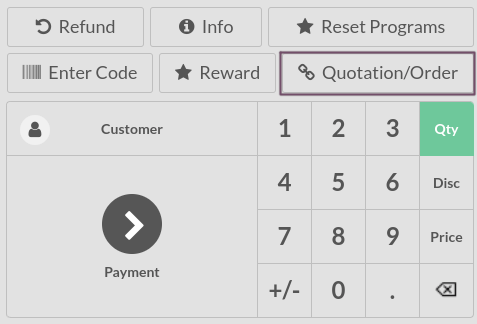
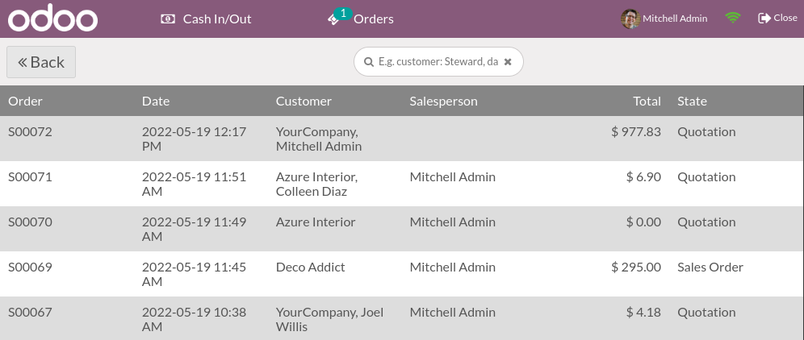

============
Sales orders
============

When working in retail, you might need to order products directly from your Điểm bán hàng.
Fortunately, Leansoft Điểm bán hàng is fully integrated with Leansoft Sales, meaning that you can create a
sales order and pay for it directly from your Điểm bán hàng.

Select a sales order
====================

From the **Điểm bán hàng** application, open a new session. Then, click on
:guilabel:`Quotations/Orders` to get the complete list of quotations and sales orders created on the
sales application.

.. note::
   To ease finding the right sales order, you can filter that list on the **customer** or on the
   **order reference**. You can also set the customer before clicking on
   :guilabel:`Quotations/Orders` to reduce the list to one particular customer.

Apply a down payment or settle the order
========================================

From the list of sales order, select one to make a payment.

You can either:

- Settle the order **partially**: after clicking on :guilabel:`Apply a down payment`, enter the
  percentage of down payment you want the customer to pay. Then, click on :guilabel:`ok` and proceed
  with the order.
- Settle the order **completely**: click on :guilabel:`Settle the order` to pay for the total of the
  sales order.

.. note::
   Once you settle a sales order, the applied down payment is automatically deducted from the total
   amount.

.. Seealso::
   - :doc:`/applications/sales/sales/invoicing/down_payment`
